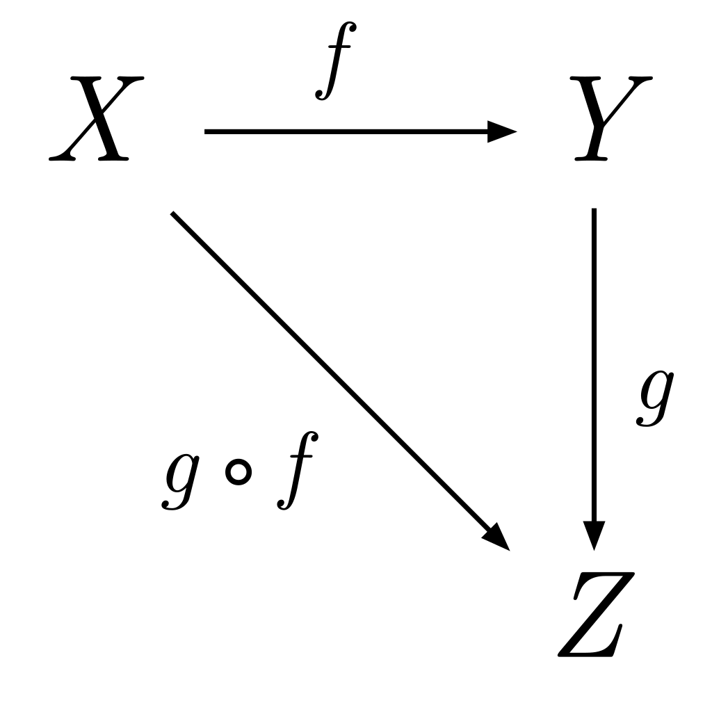

# awesome-category-theory 🕶️

## Articles

* [Applied category theory - John D. Cook](https://www.johndcook.com/blog/applied-category-theory/)

## Threads

* [[Hacker News] An invitation to category theory](https://news.ycombinator.com/item?id=18267536)

## Blog Series

* [From Design Patterns to Category Theory - Mark Seemann](https://blog.ploeh.dk/2017/10/04/from-design-patterns-to-category-theory/)
* [Things I Wish Someone Had Explained About Functional Programming - James Sinclair](https://jrsinclair.com/articles/2019/what-i-wish-someone-had-explained-about-functional-programming/)

## YouTube

* [Category Theory, The essence of interface-based design - Erik Meijer](https://www.youtube.com/watch?v=JMP6gI5mLHc)
* [Category Theory for the Working Hacker - Philip Wadler](https://www.youtube.com/watch?v=V10hzjgoklA)
* [Propositions as Types - Philip Wadler](https://www.youtube.com/watch?v=IOiZatlZtGU)

## Category Theory for Programmers - Bartosz Milewski

* [[Blog] Category Theory for Programmers - Bartosz Milewski](https://bartoszmilewski.com/2014/10/28/category-theory-for-programmers-the-preface/)
* [[YouTube] Category Theory for Programmers - Bartosz Milewski](https://www.youtube.com/playlist?list=PLbgaMIhjbmEnaH_LTkxLI7FMa2HsnawM_)
* [[YouTube] Category Theory for Programmers Book Review](https://www.youtube.com/playlist?list=PLVFrD1dmDdvcjCQDPhExqP56jqxp0Ssn_)
